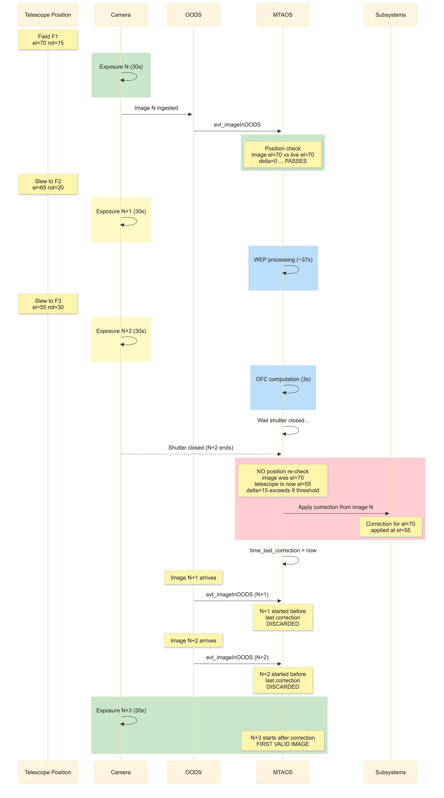

.. _Closed_Loop_Analysis:

##########################################
Closed Loop Behavior Analysis
##########################################

This section presents an analysis of the MTAOS closed-loop behavior, focusing on the parameter space, special cases that modify control parameters at runtime,
and potential issues identified during code review.

This analysis was motivated by the question: 
*"What is the current logic and parameter space options, including all the special cases that trigger changes in the parameters of the state estimation and PID loop?"*

For the factual description of the closed loop flow and its configuration, see :ref:`Closed_Loop_Operations`.

.. _Closed_Loop_Key_Behaviors:

Key Behaviors
=============

The following behaviors emerge from how the current implementation and configuration interact.
They are not immediately obvious from reading the code or configuration, and result from a combination of multiple design choices (e.g. PID reset mechanism, config overrides, WEP pipeline output, elevation check semantics, etc).
Understanding these is essential for interpreting the system's performance and diagnosing unexpected behavior.

Proportional-only control
--------------------------

The ``comp_dof_idx`` set/restore cycle in :py:meth:`~lsst.ts.mtaos.MTAOS._execute_ofc` resets the PID integral, derivative, and previous error every iteration.
Combined with the current config (``ki=0``, ``kd=0``), the controller operates as proportional-only.
Even if ``ki`` or ``kd`` were configured non-zero, they would not accumulate across iterations.

Implication: the system cannot build up correction for persistent biases that the proportional term alone cannot eliminate in a single step.
Whether this matters depends on how well the subsystem LUTs pre-compensate for gravity and thermal effects.

The ``zn_selected`` parameter is overridden by WEP
--------------------------------------------------

The ``zn_selected`` parameter from configuration is overwritten inside :py:meth:`~lsst.ts.mtaos.Model.calculate_corrections` (line 1683) by the Zernike indices that WEP actually produced.
The configured value has no effect on the final correction. This is not inherently problematic, but it should remain explicit and well understood.

Two elevation checks with different semantics
----------------------------------------------

Elevation is checked at two separate points:

1. **Image filtering** (before WEP):
   compares the image's position to the *live telescope position*.
   Also checks rotation.
   Purpose: skip images from a position the telescope has already left.

2. **Gain scaling** (after WEP, before OFC):
   compares *consecutive image elevations* (previous vs current).
   Purpose: detect large slews between observations and reduce gain.
   Does not check rotation.

These are distinct checks with different reference points and different actions (skip vs scale).

Configuration precedence
-------------------------

Parameters are loaded at three levels:

1. **OFC controller config** (``MTAOS/ofc/configurations/init.yaml``)
   — loaded at OFCData initialization.
2. **CSC config** (``MTAOS/v13/_init.yaml``)
   — applied at CSC startup; overrides OFC-level.
3. **Runtime config** (:py:meth:`~lsst.ts.mtaos.MTAOS.do_startClosedLoop`)
   — applied per iteration; overrides both previous levels.

WEP output overrides ``zn_selected`` regardless of all three levels.

.. _Closed_Loop_Identified_Issues:

Potential Issues
=================

The following items have been identified during code review
and operational analysis.
They are documented here for future investigation and discussion.

.. _Closed_Loop_Processing_Latency:

Processing latency and control loop lag
----------------------------------------

The time from shutter close to usable Zernike coefficients determines how many exposures pass before a correction can be applied.
Measured operational performance:

- **Best case**: 25–35 s (clean field, healthy pipeline)
- **Typical**: 35–45 s
- **Long tail**: 50–75 s (bad pixels, blended donuts, crowded fields, slow fits)

With 30 s exposures, the correction computed from image N is typically applied after images N+1 and N+2 have already been taken (or are in progress).
The system currently operates at **N+2 to N+3 latency**: the correction from image N is applied during/after image N+2 or N+3.

This means each correction is based on the optical state **2–3 fields ago** — potentially at a significantly different elevation and rotator angle.

.. _Closed_Loop_Position_Mismatch:

Elevation/rotation position check has a timing gap
----------------------------------------------------

The closed loop includes a position check designed to skip corrections when the telescope has moved too far from where the image was taken.
This check compares the image's elevation/rotation to the live telescope position and skips the image if the delta exceeds ``elevation_delta_limit_max`` (9°) or ``rotation_delta_limit`` (9°).

The intent sounds reasonable: avoid applying a correction derived at one pointing to a significantly different pointing.
However, the check runs only **at image arrival time** (when the OODS event is received, T=32 s in the timeline below), not when the correction is actually applied.

With 30–75 s of processing latency between arrival and application, the telescope continues slewing to new fields.
The position delta that was within limits at arrival time may exceed limits by the time the correction is applied, but this is not re-evaluated.

In other words:

- If the telescope has already moved far **before** the image arrives → the check catches it correctly → image is skipped ✅ 
- If the telescope moves far **during** the 30–75 s processing window → the check already passed → correction is applied at the wrong position without re-validation ❌

The protection works as intended when processing latency is small relative to slew rates.
With the current N+2 to N+3 latency, the telescope can move significantly during processing, creating a gap where the check's guarantee no longer holds at the moment of application.

   Timeline showing the timing gap.
   The position check passes at image arrival (el delta = 0°) because the telescope is still at the same field.
   By the time the correction is applied (~70 s later), the telescope has slewed to a different field (el delta = 15°, exceeding the 9° threshold).
   The check is not repeated before application.

Timeline with realistic latency:

.. code-block:: text

   T=0s:     Image N starts exposure at field F1 (el=70°, rot=15°)
   T=30s:    Image N exposure ends, shutter closes
   T=32s:    Image N arrives in OODS → MTAOS starts processing
   T=33s:    Image N passes filtering (live position ≈ still near F1)
   T=33s:    Image N+1 starts at field F2 (el=65°, rot=20°)
   T=63s:    Image N+1 ends
   T=65s:    Image N+1 arrives in OODS (queued)
   T=65s:    Image N+2 starts at field F3 (el=55°, rot=30°)
   T=70s:    WEP results for image N available (~37s processing)
   T=72s:    OFC computes correction from image N
   T=73s:    MTAOS sets WAITING_APPLY, waits for shutter...
   T=95s:    Image N+2 ends, shutter closes
   T=95s:    MTAOS applies correction from image N
             Telescope is now at F3 (el=55°, rot=30°)
             Correction was computed for F1 (el=70°, rot=15°)
             time_last_correction_applied = T=95s

The correction from el=70° is applied when the telescope is at el=55°.
There is **no re-check** at T=95s comparing the image's position to the current position.

A potential improvement: before commanding the subsystems at T6, re-read the live telescope position and compare to the image's position.
If the delta exceeds a threshold, skip or scale the correction.
This would add a small delay but prevent applying stale corrections.

.. _Closed_Loop_Stale_Image_Discarding:

Stale image discarding
-----------------------

The timing diagram above also shows what happens to the intermediate images (N+1, N+2) that were taken during processing.
The ``discard_intermediate_corrections`` feature handles this: after applying the correction at T=95s, images whose exposure started before that timestamp are discarded.

As shown in the diagram:

- Image N+1 (started at T=33s) → discarded (started 62s before correction)
- Image N+2 (started at T=65s) → discarded (started 30s before correction)
- Image N+3 (started after T=95s) → first valid image, reflects the corrected state

This ensures the next measurement used for computing corrections is from **after** the previous correction was applied, so it reflects the actual effect of that correction.

Both the position mismatch and the stale discarding are consequences of the same processing latency (N+2 to N+3).
They address different aspects of the problem:

- **Position mismatch** (above): the correction from image N is applied at a position the telescope has already moved away from.
  This is not currently re-checked before application.

- **Stale discarding**: intermediate images taken during processing do not reflect the corrected state and must be skipped.
  This is correctly handled by ``discard_intermediate_corrections``.

.. _Closed_Loop_Filter_Change:

Filter change handling
-----------------------

The filter change detection and correction flow involves several interactions between the MTAOS, the camera, and the hexapod subsystems.

**How filter changes interact with the closed loop:**

1. No images are taken during a filter change (~120 s) because the camera shutter is closed while the filter wheel moves.
2. The hexapod CSC applies the filter LUT offset independently (e.g., camera hex dZ changes by -378 µm for r→i).
   This is a **separate layer** from the AOS correction.
3. The first image after the filter change arrives with the new filter label in its metadata.
4. MTAOS detects the change by comparing `filter_label` of the current image to `prev_filter` from the last processed image.

**What happens to the last old-filter correction:**

The correction computed from the last old-filter image may be applied during the filter change (shutter is closed, so the "wait for shutter" condition is met).
However, this is likely harmless because:

- The AOS correction and filter LUT are independent layers in the hexapod: the LUT provides the base position (including filter offset), and the AOS provides a residual correction on top.
- The AOS residual (bending modes, hexapod alignment errors) is largely filter-independent.
- The AOS does not command absolute positions that include the filter offset, it only commands the residual.

**What may be problematic:**

After the filter change, the optical state changes slightly (different glass properties, different thermal characteristics).
The AOS internal state (``controller.dof_state``) still reflects the old filter's residual.
The first image with the new filter will measure the new residual, and the OFC will compute a correction relative to the internal state, 
which may produce a larger-than-expected correction on the first iteration.

**Current mitigation:**

The ``closed_loop_filter_change_gain`` feature (currently disabled with ``n_iter = 0``) was designed to address this: it overrides the gain for N iterations after a filter change,
allowing more aggressive correction to quickly adapt to the new filter's residual.

**Timing concern:**

A filter change takes ~120 s.
If the last correction (from the old filter) is applied during the filter change, and no new images arrive for ~120 s,
the ``discard_intermediate_corrections`` mechanism has no effect (no intermediate images exist).
The first post-filter-change image is processed normally.

**No skip mechanism for filter changes (potential gap):**

There is no logic in the current code that says "a filter change is in progress — skip the pending correction."
The only filter-related mechanism is the optional gain override (``closed_loop_filter_change_gain``, currently disabled with ``n_iter = 0``).

If a correction from the old filter is still pending when the shutter closes for the filter change, the "wait for shutter closed" condition is met and the correction may be applied during the filter swap.

After the filter change completes, the first new-filter image is processed normally.
The filter change is detected by comparing image metadata, and the loop continues.

Whether the old-filter correction applied during the filter change is problematic depends on the magnitude of filter-dependent optical changes not captured by the LUT.
If the AOS internal state diverges significantly after a filter change, the first new-filter correction may be unnecessarily large.

This needs investigation: a potential improvement would be to detect that a filter change is in progress (e.g., via camera events) and either skip pending corrections or reset the internal DOF state.

.. _Closed_Loop_PID_Reset:

PID integral reset
-------------------

The integral reset (due to ``comp_dof_idx`` set/restore) prevents the controller from accumulating correction for persistent biases.
If biases exist (imperfect LUTs, unmodeled thermal effects), the proportional term can only reduce them by the ``kp`` fraction per iteration — never reaching zero.

Whether this is a practical limitation depends on:

- Magnitude of persistent biases vs measurement noise
- Quality of subsystem LUT compensation
- Target image quality requirements

.. _Closed_Loop_Comparison:

Comparison: Closed Loop vs close_loop Script
============================================

Both paths use the same PID controller
----------------------------------------

Both the ``close_loop_lsstcam.py`` script and the MTAOS :py:meth:`~lsst.ts.mtaos.MTAOS.run_closed_loop` task call the **same underlying OFC** (``ts_ofc``) through the same MTAOS commands.
The script calls ``cmd_runOFC`` which internally invokes :py:meth:`~lsst.ts.mtaos.MTAOS._execute_ofc` — the same function the closed loop calls directly.

In both cases, the per-iteration correction is computed by:

1. State estimation (``dof_state`` from wavefront error)
2. PID ``control_step``: ``uk = kp × error + ki × integral + kd × derivative``
3. DOF aggregation and component corrections

The PID integral is reset in both paths (due to ``comp_dof_idx`` set/restore triggering ``reset_history()``), so both effectively operate as proportional-only controllers.

Outer loop orchestration differs
---------------------------------

The difference is in **how the outer loop is managed** — who decides when to take images, what gain to use, and when to stop:

**close_loop script:**

.. code-block:: text

   for i in range(max_iter):
       1. Point telescope (fixed az/el/rot)
       2. Take image (script controls timing)
       3. cmd_runWEP → MTAOS processes WFE
       4. cmd_runOFC(userGain=gain_sequence[i]) → MTAOS runs PID
       5. cmd_issueCorrection → apply
       6. Check: if visitDoF < threshold → STOP
   If max_iter reached → stop with warning

**MTAOS closed loop:**

.. code-block:: text

   while enabled:
       1. Wait for OODS image event (scheduler controls pointing)
       2. Filter image (stale? pointing changed?)
       3. _execute_wavefront_estimation → WEP
       4. Compute gain from elevation delta
       5. _execute_ofc(userGain=gain) → PID
       6. Wait shutter closed → apply correction
       7. No convergence check → continue waiting

Summary table
--------------

.. list-table::
   :header-rows: 1
   :widths: 25 37 38

   * - Aspect
     - close_loop script
     - MTAOS closed loop
   * - Control algorithm
     - Same PID (via ``cmd_runOFC``)
     - Same PID (via ``_execute_ofc``)
   * - Image source
     - Script takes images (synchronous)
     - Reacts to OODS events (asynchronous)
   * - Pointing
     - Fixed az/el/rot (re-pointed each iteration)
     - Variable (FBS scheduler decides)
   * - Gain source
     - ``gain_sequence`` (scalar per iteration, e.g. [0.75, 0.75, 0.5])
     - ``controller.kp`` array, scaled by elevation delta
   * - Outer loop termination
     - Stops when ``visitDoF < threshold`` or ``max_iter`` reached
     - No termination condition; runs until ``stopClosedLoop``
   * - Elevation scaling
     - None (fixed pointing)
     - Yes (skip/scale based on consecutive image elevations)
   * - Stale image handling
     - N/A (script takes fresh images immediately)
     - ``discard_intermediate_corrections``
   * - PID integral
     - Reset each iteration (same ``comp_dof_idx`` mechanism)
     - Reset each iteration (same mechanism)

How the script achieves convergence
------------------------------------

The script converges **not** through PID integral buildup, but through repeated proportional corrections:

1. Each iteration measures the **current** optical state (fresh image)
2. The PID computes ``uk = kp × state`` (proportional-only, since integral is reset)
3. The correction reduces the state by the ``kp`` fraction
4. The next iteration measures the reduced state
5. If the remaining state is below ``threshold``, stop

With ``kp = 0.75``:

- Iteration 1: correct 75% → 25% remains
- Iteration 2: correct 75% of 25% → 6.25% remains
- Iteration 3: correct 75% of 6.25% → 1.56% remains

This geometric convergence works because the telescope is at a **fixed pointing** — the optical state doesn't change between iterations except for the correction applied.

Why the MTAOS closed loop does not converge the same way
---------------------------------------------------------

The MTAOS closed loop cannot converge in the same sense because:

- The telescope **slews between images** — the optical state changes due to gravity, thermal effects, and LUT residuals at each new pointing
- The "target" (zero DOF state) is never reached because the real optical state keeps changing with each new field
- The gain (kp=0.45) is lower than the script's typical gain (0.5–0.75)
- Each correction addresses the state at the *previous* pointing, not the current one

The closed loop is designed to **track** a changing optical state, not converge to a fixed point.
The question is whether the current orchestration (gain values, timing, position checks) achieves good tracking.

