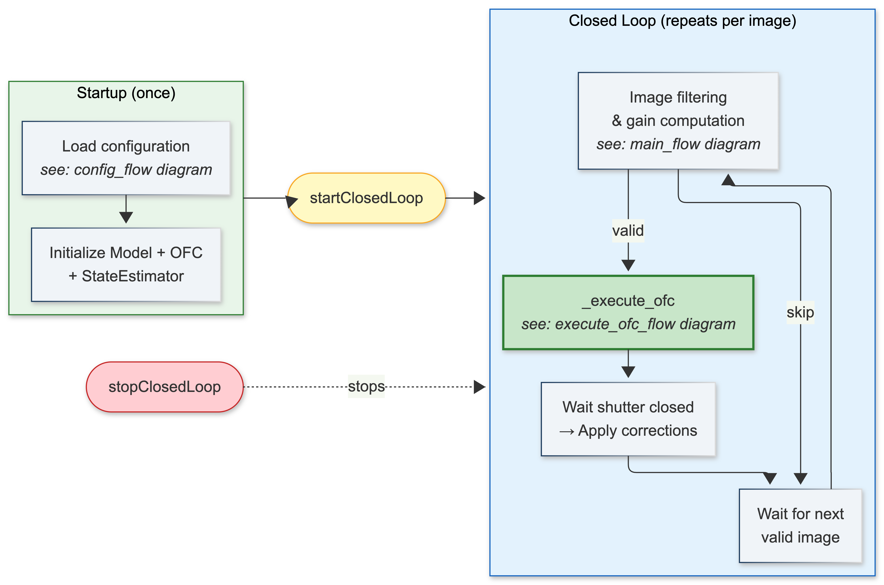
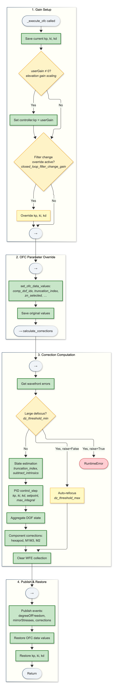

.. _Closed_Loop_Operations:

########################
Closed Loop Operations
########################

This section documents the MTAOS closed-loop correction task, including its operational flow, configuration options, decision points, and interactions with other subsystems.

.. _Closed_Loop_Overview:

Overview
========

The MTAOS closed-loop task (:py:meth:`~lsst.ts.mtaos.MTAOS.run_closed_loop`) continuously monitors incoming images from the corner wavefront sensors, estimates the current optical state, computes corrections via the Optical Feedback Control (OFC), and applies those corrections to the telescope subsystems (M1M3, M2, hexapods).

The loop is event-driven: it reacts to ``evt_imageInOODS`` events published by the Observatory Operations Data Service (``MTOODS``) when images are ingested into the butler.
Upon receiving this notification, MTAOS queries the Rapid Analysis (RA) pipeline for wavefront estimation results (or triggers the pipeline if results are not yet available).
This distinguishes it from the ``close_loop_lsstcam.py`` script used during initial alignment, which orchestrates both image acquisition and correction in a synchronous loop.

.. note::

   The ``close_loop_lsstcam.py`` script and the MTAOS closed loop differs in orchestration, gain handling, and image processing flow.
   A more detailed comparison is provided in :ref:`Closed_Loop_Comparison`.
   Understanding these differences is important when diagnosing performance discrepancies between initial alignment and survey operations.

At a high level, the closed loop operates as follows:

1. **Configuration** is loaded once at startup (CSC config + OFC controller config).
2. The :py:meth:`~lsst.ts.mtaos.MTAOS.do_startClosedLoop` command starts the loop.
3. For each valid image, the loop:

   a. **Filters** — checks if the image is stale, if the pointing has changed too much, and computes the elevation-based gain.
   b. **Computes corrections** via :py:meth:`~lsst.ts.mtaos.MTAOS._execute_ofc` — this temporarily overrides gains and OFC parameters, runs the state estimator to reconstruct the DOF state from the measured wavefront error,
      applies the PID controller to compute a correction, aggregates the correction into the internal DOF state, and converts the DOF correction into component commands (hexapod positions, mirror forces).
      All overrides are restored after computation.
   c. **Applies corrections** — waits for the camera shutter to close, then sends commands to the hexapods, M1M3, and M2.

4. The loop repeats until :py:meth:`~lsst.ts.mtaos.MTAOS.do_stopClosedLoop` is issued or a fatal error occurs.

   High-level structure of the MTAOS closed loop. Configuration is
   loaded once at startup (green). The :py:meth:`~lsst.ts.mtaos.MTAOS.do_startClosedLoop` command
   initiates the loop (yellow), which repeats for each valid image
   (blue): filter the image, compute the OFC correction, and apply it.
   Images that fail filtering loop back to wait without computing
   corrections. The :py:meth:`~lsst.ts.mtaos.MTAOS.do_stopClosedLoop` command (red) terminates the
   loop externally. Each box references the detailed diagram that
   expands that phase.

.. _Closed_Loop_Lifecycle:

Lifecycle
=========

The closed loop is started via the :py:meth:`~lsst.ts.mtaos.MTAOS.do_startClosedLoop` command and runs
as a background task until either:

- The :py:meth:`~lsst.ts.mtaos.MTAOS.do_stopClosedLoop` command is issued
- The CSC transitions out of ENABLED state
- A fatal error occurs (too many consecutive failures)

During operation, the loop publishes its state via the
``evt_closedLoopState`` event, cycling through:

1. **WAITING_IMAGE** — Idle, waiting for the next OODS event
2. **PROCESSING** — Running wavefront estimation and OFC
3. **WAITING_APPLY** — Waiting for the camera shutter to close before
   applying corrections
4. **ERROR** — A fatal error occurred; the loop has stopped

The following diagram shows the detailed flow with all decision points,
skip conditions, and fault states:

.. figure:: _static/closed_loop_main_flow.png
   :alt: Closed loop main flow diagram
   :width: 100%

   Main flow of the :py:meth:`~lsst.ts.mtaos.MTAOS.run_closed_loop` task. Green nodes show the
   happy path (normal correction cycle). Yellow nodes indicate skip
   conditions. Red nodes indicate fault states. Configuration
   parameters from ``ts_config_mttcs`` that control each decision
   point are shown in italics within the nodes.

.. _Closed_Loop_Image_Selection:

Image Selection and Filtering
=============================

Not every image that arrives is processed. The loop applies several
filters:

Following list
--------------

The MTAOS maintains a list of images it is "following" — images whose
start-integration events were received. Only images in this list are
processed. Images not in the following list are logged and skipped.

Stale image discarding
----------------------

When ``discard_intermediate_corrections`` is enabled (default), images
whose exposure started **before** the last applied correction are
skipped. This prevents the loop from processing images that do not
reflect the most recent correction.

Elevation and rotation limits
-----------------------------

If the current telescope position has changed significantly since the
image was taken:

- **Elevation delta** > ``elevation_delta_limit_max`` (default 9°): skip
- **Rotation delta** > ``rotation_delta_limit`` (default 9°): skip

These thresholds prevent applying corrections derived from an image taken
at a substantially different pointing.

.. _Closed_Loop_WEP:

Wavefront Estimation
====================

Once an image passes filtering, the MTAOS runs wavefront estimation to
extract Zernike coefficients from the corner wavefront sensor data.

The production configuration uses ``use_ocps = True``,
which delegates wavefront estimation to the Rapid Analysis (RA)
pipeline via the OCS Control Pipeline Service (OCPS):

1. Check if RA has already processed the image
2. If not, send ``cmd_execute`` to OCPS with the visit ID
3. Poll the butler for results (``zernike_table_name`` in
   ``run_name`` collection)
4. Read Zernike tables once available

The WEP pipeline configuration is controlled by the RA deployment,
not by the MTAOS ``wep_config``.
Only visit IDs are passed to OCPS.

.. note::

   A local execution path (``use_ocps = False``) exists
   but is not used in production.
   It spawns a local ``pipetask`` subprocess
   using the MTAOS ``wep_config``.
   This path may produce different wavefront estimates
   if the RA pipeline uses a different WEP version or configuration.

.. _Closed_Loop_Gain:

Gain Computation
================

Before computing corrections, the MTAOS determines the gain to apply
based on the elevation change between **consecutive processed images**
(previous image elevation vs current image elevation).

.. note::

   This is distinct from the earlier elevation/rotation check in
   :ref:`Closed_Loop_Image_Selection`, which compares the image's
   position to the **current telescope position** (to detect if the
   telescope has moved since the image was taken).
   The gain computation here compares **consecutive images**
   to detect large slews between observations.
   Only elevation is used for gain scaling;
   rotation delta is only checked in the earlier filtering step.

.. code-block:: text

   elevation_delta = |current_elevation - previous_elevation|

   If elevation_delta > elevation_delta_limit_max (9°):
       gain = 0  →  skip corrections entirely

   If elevation_delta < elevation_delta_limit_min (4°):
       gain = controller.kp  (full gain from OFC config)

   If elevation_delta_limit_min < elevation_delta < elevation_delta_limit_max:
       gain = scaled kp  (linearly interpolated)

When ``gain = 0``, the entire OFC step is skipped and the loop waits
for the next image.

Filter change gain override
---------------------------

If a filter change is detected and ``closed_loop_filter_change_gain``
is configured with ``n_iter > 0``, the gains (kp, ki, kd) are
temporarily overridden for the specified number of iterations after
the filter change. This allows more aggressive correction immediately
after a filter swap.

.. _Closed_Loop_OFC:

OFC Correction Computation
==========================

Once an image passes all checks (not stale, within pointing limits,
gain > 0), the main loop calls :py:meth:`~lsst.ts.mtaos.MTAOS._execute_ofc` to compute the
correction for that single image. This function is called **once per
valid image** — the closed loop itself is driven by the main
:py:meth:`~lsst.ts.mtaos.MTAOS.run_closed_loop` flow (see the main flow diagram above). After
:py:meth:`~lsst.ts.mtaos.MTAOS._execute_ofc` returns, the main loop waits for the camera shutter
to close, applies the correction, and then returns to waiting for the
next OODS image event.

The :py:meth:`~lsst.ts.mtaos.MTAOS._execute_ofc` function orchestrates the interaction with the
OFC library (``ts_ofc``) for a single correction cycle:

   Internal flow of :py:meth:`~lsst.ts.mtaos.MTAOS._execute_ofc` for a single correction cycle.
   Green nodes show the happy path (normal correction without special
   cases). Yellow nodes indicate decision points and alternate paths
   (filter override, auto-refocus). Red indicates error states.
   Configuration parameters from ``ts_config_mttcs`` that affect each
   step are shown in italics.

Execution phases
----------------

Each call to :py:meth:`~lsst.ts.mtaos.MTAOS._execute_ofc` proceeds through four phases
(corresponding to the subgroups in the diagram):

**Phase 1 — Gain Setup:**

- Save current kp, ki, kd for later restoration
- If ``userGain != 0``: override ``controller.kp`` with the
  elevation-scaled gain
- If filter change override is active: override kp/ki/kd with
  ``filter_change_gains``

**Phase 2 — OFC Parameter Override:**

- Call :py:meth:`~lsst.ts.mtaos.Model.set_ofc_data_values` to apply per-iteration config
  (``comp_dof_idx``, ``truncation_index``, ``zn_selected``, etc.)
- Save the original OFC values for restoration

**Phase 3 — Correction Computation** (runs in executor thread):

- Retrieve wavefront errors from the collection
- Check for large defocus; if detected, either raise or auto-refocus
- If normal: run state estimation → PID control step → aggregate
  DOF state → compute component corrections (hexapod, M1M3, M2)

**Phase 4 — Publish & Restore:**

- Publish events (degreeOfFreedom, mirrorStresses, corrections)
- Restore original OFC data values
- Restore original kp, ki, kd

.. important::

   The :py:meth:`~lsst.ts.mtaos.Model.set_ofc_data_values` call for ``comp_dof_idx`` triggers
   ``controller.reset_history()``, which zeros the PID integral,
   previous error, and filtered derivative. This means the PID
   integral does not accumulate across iterations when
   ``comp_dof_idx`` is in the per-iteration config.

Zernike selection override
--------------------------

Inside :py:meth:`~lsst.ts.mtaos.Model.calculate_corrections`, the ``zn_selected`` value from the
config is **overwritten** by the Zernike indices actually produced by
WEP (``model.py:1683``). This means the ``zn_selected`` passed via the
:py:meth:`~lsst.ts.mtaos.MTAOS.do_startClosedLoop` config or the OFC controller config does not
determine which Zernikes are used — WEP does.

Large defocus handling
----------------------

If the measured defocus (from donut radii) exceeds
``dz_threshold_min``:

- If ``raise_on_large_defocus = True``: raise an error and stop the
  closed loop
- If ``raise_on_large_defocus = False``: automatically refocus by
  applying a hexapod dZ offset (clipped to ``dz_threshold_max``),
  then skip the OFC correction for this iteration

.. _Closed_Loop_State_Estimation:

State Estimation and PID Control Parameters
============================================

This section details how configuration parameters affect the state
estimation (DOF reconstruction from wavefront errors) and the PID
controller that computes the correction.

State estimation pipeline
-------------------------

The state estimation in ``ts_ofc`` proceeds as:

1. **Sensitivity matrix evaluation** — The double Zernike sensitivity
   matrix is evaluated at the corner wavefront sensor field angles,
   rotated by the current camera rotation angle. The sensitivity matrix
   maps DOFs to Zernike wavefront errors and depends on:

   - Sensor field angles (fixed in hardware)
   - Camera rotation angle (from the rotator position during exposure)
   - Does **not** depend on elevation or azimuth

2. **Normalization** — DOFs are normalized to comparable scales via a
   diagonal normalization matrix (from ``normalization_weights_filename``).
   This prevents DOFs with large physical units (hexapod µm) from
   dominating over DOFs with small units (bending mode coefficients).

3. **SVD truncation** — The normalized sensitivity matrix is decomposed
   via SVD. Only the first ``truncation_index`` singular modes (v-modes)
   are retained. Modes beyond this index are considered noise-dominated
   and discarded during the pseudo-inverse computation.

4. **Noise covariance weighting** — The measurement noise covariance
   matrix weights the least-squares inversion, down-weighting noisy
   Zernike modes and sensors.

5. **Intrinsic subtraction** — If ``subtract_intrinsics = True``, the
   design wavefront (from the Double Zernike intrinsic model) is
   subtracted from the measured WFE before state estimation. This removes
   the known static aberrations so the estimator only sees residual
   errors from misalignment.

Parameters that change state estimation behavior
^^^^^^^^^^^^^^^^^^^^^^^^^^^^^^^^^^^^^^^^^^^^^^^^^

.. list-table::
   :header-rows: 1
   :widths: 25 75

   * - Parameter
     - Effect on state estimation
   * - ``truncation_index``
     - Controls how many v-modes are retained. Lower values discard
       more modes (safer but less DOF resolution). Higher values retain
       more modes (better resolution but more noise sensitivity).
   * - ``used_dofs`` / ``comp_dof_idx``
     - Determines which DOFs participate. Changes the dimension of
       the problem: n_used_dofs → n_vmodes. Fewer DOFs = fewer v-modes
       = simpler estimation.
   * - ``subtract_intrinsics``
     - When False, the estimator sees the full wavefront including
       design aberrations. The OFC then tries to "correct" these,
       which may not be desirable. Set to False only if the intrinsic
       model is inaccurate.
   * - ``rotation_angle``
     - Rotates the sensitivity matrix evaluation. Different rotation
       angles produce different sensitivity matrices, leading to
       different DOF estimates for the same physical state.
   * - ``zn_selected``
     - Determines which Zernike modes participate in the fit.
       **Note**: this is overwritten by WEP output (the Zernikes
       that WEP actually produces).
   * - ``normalization_weights``
     - Scales DOFs for the pseudo-inverse. Affects the relative
       weighting of different DOFs in the estimation.

PID controller behavior
------------------------

The PID controller computes the correction at each iteration:

.. code-block:: text

   error = setpoint[dof_idx] - estimated_state
   integral += error  (clipped by max_integral)
   derivative = (error - previous_error) × derivative_filter_coeff
   uk = kp × error + ki × integral + kd × derivative

The correction ``-uk`` is then applied (negative feedback).

Parameters that change PID behavior
^^^^^^^^^^^^^^^^^^^^^^^^^^^^^^^^^^^^

.. list-table::
   :header-rows: 1
   :widths: 20 80

   * - Parameter
     - Effect on PID control
   * - ``kp``
     - Proportional gain. Controls aggressiveness. With kp=0.45,
       each iteration corrects 45% of the estimated error. Higher
       values converge faster but risk overshoot. Can be a scalar
       (uniform) or a 50-element array (per-DOF or per-vmode gains).
   * - ``ki``
     - Integral gain. Accumulates past errors to eliminate
       steady-state bias. Currently zeroed (ki=0) in most configs.
       **Note**: the integral is reset every iteration due to the
       ``comp_dof_idx`` set/restore cycle in :py:meth:`~lsst.ts.mtaos.MTAOS._execute_ofc`.
   * - ``kd``
     - Derivative gain. Damps oscillations by opposing rapid changes.
       Currently zeroed (kd=0) in most configs.
   * - ``max_integral``
     - Per-DOF clipping limits on the integral term. Prevents
       integral windup. With ki=0, this has no effect.
   * - ``setpoint``
     - Target DOF state (currently all zeros). The PID drives the
       system toward this state.
   * - ``xref``
     - Reference point strategy for the OIC controller. Options:
       ``x00`` (zero reference), ``x0`` (initial state), ``0`` (zero).

Special cases that modify PID parameters during the loop
^^^^^^^^^^^^^^^^^^^^^^^^^^^^^^^^^^^^^^^^^^^^^^^^^^^^^^^^^

The following conditions cause the effective PID parameters to differ
from the static config values:

1. **Elevation-based gain scaling** (:py:meth:`~lsst.ts.mtaos.Model.get_correction_gain`):

   - If elevation delta > ``elevation_delta_limit_max``: kp → 0
     (skip corrections entirely)
   - If ``elevation_delta_limit_min`` < delta < ``elevation_delta_limit_max``:
     kp → scaled linearly between full and zero
   - Otherwise: kp = configured value (full gain)

2. **Filter change override** (``closed_loop_filter_change_gain``):

   - After a filter change, kp/ki/kd can be temporarily overridden
     for ``n_iter`` iterations
   - Allows more aggressive correction after filter swap
   - Configured via ``gain: [kp_override, ki_override, kd_override]``
   - ``null`` values in the gain list mean "do not override that gain"

3. **``comp_dof_idx`` set/restore cycle**:

   - Each iteration sets then restores ``comp_dof_idx``
   - The set triggers ``controller.reset_history()``
   - This zeros: integral, previous_error, filtered_derivative
   - **Effect**: ki and kd terms are effectively dead even if configured

4. **``userGain`` override** (via ``cmd_runOFC`` or closed loop gain):

   - The computed gain replaces the controller's ``kp`` for that
     iteration
   - Original ``kp`` is restored after the iteration

Control in v-mode space (``control_vmodes = True``)
----------------------------------------------------

When ``control_vmodes`` is enabled, the PID operates in v-mode space
rather than DOF space:

1. The DOF state estimate is projected into v-mode coordinates via SVD
2. The PID computes corrections in v-mode space
3. The v-mode correction is projected back to DOF space

This allows assigning different gains to different optical importance
levels (v-modes ordered by singular value). However, in the current
implementation:

- Gains ``kp[dof_idx]`` are indexed **positionally** to v-mode
  coefficients (not physically transformed)
- ``max_integral[dof_idx]`` clipping applies DOF-space limits to
  v-mode integrals
- With uniform scalar ``kp``, v-mode control is mathematically
  equivalent to DOF-space control (the v-mode round-trip cancels)

For the mathematical details, see `SOTN-001 <https://sotn-001.lsst.io>`_.

.. _Closed_Loop_Apply:

Correction Application
======================

After OFC computes corrections, MTAOS waits for the camera shutter
to close (ensuring the current exposure is not disturbed), then
applies corrections to each subsystem:

- **M2 Hexapod**: position offsets (dZ, dX, dY, rX, rY)
- **Camera Hexapod**: position offsets
- **M1M3**: bending mode forces (converted from DOF coefficients)
- **M2**: axial forces (converted from DOF coefficients)

Force thresholds
----------------

Before commanding each mirror:

- **M1M3**: skips if no force values exceed ``m1m3_min_forces_to_apply``
- **M2**: skips if all delta forces are below ``m2_min_forces_to_apply``

These prevent sending negligible actuator commands.

Stress limits
-------------

Before applying bending mode forces, the total mirror stress is
checked:

- Compute RSS of individual bending mode stresses × ``stress_scale_factor``
- If stress > limit (``m1m3_stress_limit`` or ``m2_stress_limit``):
  - **scale** approach: reduce all bending modes proportionally
  - **truncate** approach: zero out highest-order modes until within limit

.. _Closed_Loop_DOF_State:

DOF State Management
====================

The OFC maintains an internal aggregated DOF state that tracks the
cumulative corrections applied:

.. code-block:: text

   aggregated_state += uk  (each iteration)

This state is published via ``evt_degreeOfFreedom`` and is preserved
across CSC state transitions (FAULT → DISABLED → ENABLED) via the
``previous_dofs`` mechanism.

The aggregated state can be reset via the :py:meth:`~lsst.ts.mtaos.MTAOS.do_resetWavefrontCorrection`
command or by starting with a ``set_dof.py`` script.

.. _Closed_Loop_Config:

Configuration Reference
=======================

.. figure:: _static/config_flow.png
   :alt: Configuration flow diagram
   :width: 100%

   How configuration flows from CSC config to OFC to per-iteration
   overrides. The WEP output overrides ``zn_selected`` regardless of
   what was configured.

Configuration is loaded in two phases at startup:

1. **OFCData initialization** — The OFC controller config
   (``MTAOS/ofc/configurations/init.yaml``) is read by
   :py:meth:`~lsst.ts.ofc.OFCData.configure_controller`. This sets the PID gains (kp, ki, kd),
   truncation index, normalization weights, and other OFC-internal
   parameters.

2. **CSC configuration** — The MTAOS CSC config
   (``MTAOS/v13/_init.yaml``) is read by ``configure()``. This sets
   the operational parameters: which DOFs to use, whether to use OCPS,
   elevation/rotation limits, stress limits, and pointing correction.

During operation, the :py:meth:`~lsst.ts.mtaos.MTAOS.do_startClosedLoop` command config provides
per-session runtime overrides (green in the diagram). These are applied
and restored on each iteration via :py:meth:`~lsst.ts.mtaos.Model.set_ofc_data_values`.

Finally, on each iteration, the WEP output overwrites ``zn_selected``
with the Zernikes actually produced by the wavefront estimation pipeline
(orange in the diagram). This means the configured ``zn_selected`` value
has no effect on the final correction — it is always determined by WEP.

CSC-level parameters (``_init.yaml``)
-------------------------------------

.. list-table::
   :header-rows: 1
   :widths: 30 15 55

   * - Parameter
     - Default
     - Description
   * - ``control_vmodes``
     - False
     - Whether to perform PID control in v-mode space
   * - ``used_dofs``
     - [0..10]
     - Which DOFs participate in the correction
   * - ``subtract_intrinsics``
     - True
     - Subtract design wavefront before state estimation
   * - ``use_ocps``
     - True
     - Use OCPS/RA for wavefront estimation
   * - ``elevation_delta_limit_max``
     - 9.0
     - Skip corrections if elevation changed more than this (degrees)
   * - ``elevation_delta_limit_min``
     - 4.0
     - Scale gain if elevation changed more than this (degrees)
   * - ``rotation_delta_limit``
     - 9.0
     - Skip image if rotation changed more than this (degrees)
   * - ``stress_scale_approach``
     - scale
     - How to handle stress limit violations (scale or truncate)
   * - ``raise_on_large_defocus``
     - True
     - Whether to fault on large defocus or auto-refocus
   * - ``dz_threshold_min``
     - 300.0
     - Minimum defocus (µm) to trigger refocus
   * - ``dz_threshold_max``
     - 1500.0
     - Maximum allowed refocus offset (µm)
   * - ``max_ofc_consecutive_failures``
     - 3
     - Maximum failures before faulting

OFC controller parameters (``init.yaml``)
-----------------------------------------

.. list-table::
   :header-rows: 1
   :widths: 25 15 60

   * - Parameter
     - Default
     - Description
   * - ``kp``
     - 0.18
     - Proportional gain (scalar or 50-element array)
   * - ``ki``
     - 0.022
     - Integral gain
   * - ``kd``
     - 0.0
     - Derivative gain
   * - ``truncation_index``
     - 12
     - Number of v-modes retained in state estimation
   * - ``zn_selected``
     - [4..22]
     - Zernike indices (overridden by WEP output)
   * - ``setpoint``
     - all zeros
     - Target DOF state
   * - ``max_integral``
     - per-DOF
     - Maximum integral accumulation per DOF

Runtime override parameters (:py:meth:`~lsst.ts.mtaos.MTAOS.do_startClosedLoop` config)
------------------------------------------------------------------------------------------

These can be passed via the :py:meth:`~lsst.ts.mtaos.MTAOS.do_startClosedLoop` command and are applied
per iteration via :py:meth:`~lsst.ts.mtaos.Model.set_ofc_data_values`:

- ``truncation_index`` — override the truncation for this session
- ``comp_dof_idx`` — select which DOFs are active
- ``zn_selected`` — Zernike selection (overridden by WEP anyway)
- ``filter_name`` — current filter (set automatically)
- ``rotation_angle`` — current rotation (set automatically)

.. _Closed_Loop_Comparison:

Comparison: Closed Loop vs close_loop Script
============================================

The ``close_loop_lsstcam.py`` script (used during initial alignment)
and the MTAOS :py:meth:`~lsst.ts.mtaos.MTAOS.run_closed_loop` task use the same underlying OFC
library but differ in orchestration:

.. list-table::
   :header-rows: 1
   :widths: 25 37 38

   * - Aspect
     - close_loop script (Path A)
     - MTAOS closed loop (Path B)
   * - Image source
     - Takes its own images (synchronous)
     - Reacts to OODS events (asynchronous)
   * - Pointing
     - Fixed az/el/rot
     - Variable (FBS scheduler)
   * - Gain
     - From ``gain_sequence`` (scalar, e.g. 0.75)
     - From ``controller.kp`` array, elevation-scaled
   * - Convergence check
     - Yes (DOF threshold, max iterations)
     - None (runs indefinitely)
   * - Elevation scaling
     - None
     - Yes (skip/scale on large delta)
   * - Stale image handling
     - N/A (images are fresh)
     - ``discard_intermediate_corrections``

.. _Closed_Loop_Math_Reference:

Mathematical Reference
======================

For the mathematical formalism of the state estimation and control algorithms, see:

- `SOTN-001: V-Modes and the OFC Control Loop <https://sotn-001.lsst.io>`_