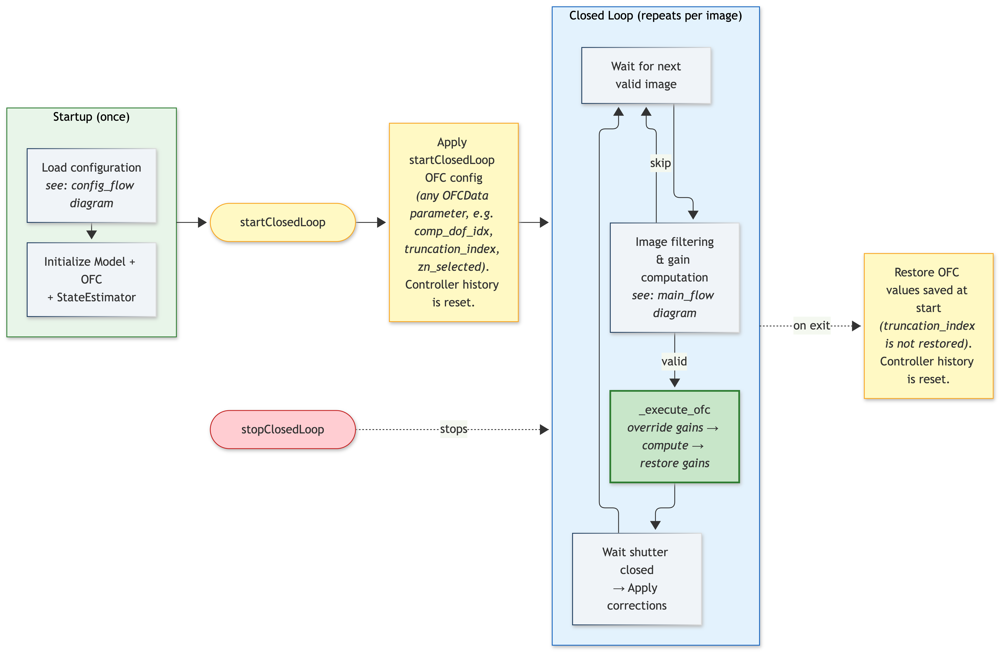
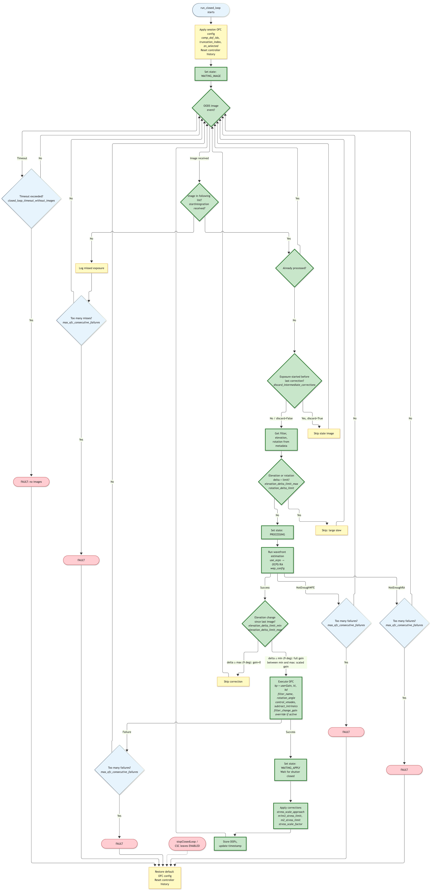
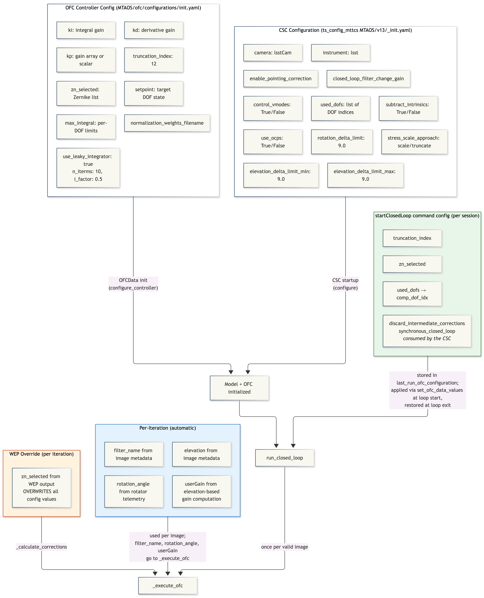

.. _Closed_Loop_Operations:

########################
Closed Loop Operations
########################

This section documents the MTAOS closed-loop correction task, including its operational flow, configuration options, decision points, and interactions with other subsystems.

.. _Closed_Loop_Overview:

Overview
========

The MTAOS closed-loop task (:py:meth:`~lsst.ts.mtaos.MTAOS.run_closed_loop`) continuously monitors incoming images from the corner wavefront sensors, estimates the current optical state, computes corrections via the Optical Feedback Control (OFC), and applies those corrections to the telescope subsystems (M1M3, M2, hexapods).

The loop is event-driven: it reacts to ``evt_imageInOODS`` events published by the Observatory Operations Data Service (``MTOODS``) when images are ingested into the butler.
Upon receiving this notification, MTAOS queries the Rapid Analysis (RA) pipeline for wavefront estimation results (or triggers the pipeline if results are not yet available).
This distinguishes it from the ``close_loop_lsstcam.py`` script used during initial alignment, which orchestrates both image acquisition and correction in a synchronous loop.

.. note::

   The ``close_loop_lsstcam.py`` script and the MTAOS closed loop differs in orchestration, gain handling, and image processing flow.
   A more detailed comparison is provided in :ref:`Closed_Loop_Comparison`.
   Understanding these differences is important when diagnosing performance discrepancies between initial alignment and survey operations.

At a high level, the closed loop operates as follows:

1. **Configuration** is loaded once at startup (CSC config + OFC controller config).
2. The :py:meth:`~lsst.ts.mtaos.MTAOS.do_startClosedLoop` command starts the loop.
   The OFC configuration passed with the command (e.g. ``comp_dof_idx``, ``truncation_index``) is applied when the loop starts and stays in effect until the loop exits.
   Applying it resets the controller history.
3. For each valid image, the loop:

   a. **Filters**: checks if the image is stale, if the pointing has changed too much, and computes the elevation-based gain.
   b. **Computes corrections** via :py:meth:`~lsst.ts.mtaos.MTAOS._execute_ofc`: this temporarily overrides the controller gains, runs the state estimator to reconstruct the DOF state from the measured wavefront error,
      applies the PID controller to compute a correction, aggregates the correction into the internal DOF state, and converts the DOF correction into component commands (hexapod positions, mirror forces).
      The gain overrides are restored after computation.
   c. **Applies corrections**: in synchronous mode (the default) waits for an explicit ``issueCorrection`` command, then waits for the camera shutter to close, then sends commands to the hexapods, M1M3, and M2.

4. The loop repeats until :py:meth:`~lsst.ts.mtaos.MTAOS.do_stopClosedLoop` is issued, the CSC leaves ENABLED, or a fatal error occurs.
   On exit, the OFC values saved at start are restored (``truncation_index`` excepted) and the controller history is reset again.

   High-level structure of the MTAOS closed loop.
   Configuration is loaded once at startup (green).
   The :py:meth:`~lsst.ts.mtaos.MTAOS.do_startClosedLoop` command initiates the loop (yellow): the session OFC configuration is applied and the controller history is reset, then the loop repeats for each valid image (blue): filter the image, compute the OFC correction (override gains → compute → restore gains), and apply it.
   Images that fail filtering loop back to wait without computing corrections.
   The :py:meth:`~lsst.ts.mtaos.MTAOS.do_stopClosedLoop` command (red) terminates the loop externally.
   On exit, for any reason, the OFC values saved at start are restored (``truncation_index`` excepted) and the controller history is reset again.
   See :ref:`Closed_Loop_Config` for the configuration flow, :ref:`Closed_Loop_Lifecycle` for the detailed main flow, and :ref:`Closed_Loop_OFC` for the correction computation.

.. _Closed_Loop_Lifecycle:

Lifecycle
=========

The closed loop is started via the :py:meth:`~lsst.ts.mtaos.MTAOS.do_startClosedLoop` command, which launches :py:meth:`~lsst.ts.mtaos.MTAOS.run_closed_loop` as a background task.
The task runs until either:

- The :py:meth:`~lsst.ts.mtaos.MTAOS.do_stopClosedLoop` command is issued
- The CSC transitions out of ENABLED state
- A fatal error occurs: too many consecutive failures, or no image arrives for ``closed_loop_timeout_without_images`` seconds

When the task starts, it applies the OFC configuration received with :py:meth:`~lsst.ts.mtaos.MTAOS.do_startClosedLoop` (described in :ref:`Closed_Loop_Session_Config` below); this configuration stays in effect for the whole session.
When the task exits, for any of the reasons above, the OFC values saved at loop start are restored.
Both steps reset the PID controller history (see :ref:`Closed_Loop_PID_History`).

The configuration is read only once, when the task starts.
Commands that update it while the loop is running do not affect the running session (see :ref:`Closed_Loop_Config`).

During operation, the loop publishes its state via the ``evt_closedLoopState`` event, cycling through:

1. **WAITING_IMAGE**: Idle, waiting for the next OODS event
2. **PROCESSING**: Running wavefront estimation and OFC
3. **WAITING_APPLY**: In synchronous mode (the default), waits for an
   explicit ``issueCorrection`` command, then waits for the camera shutter
   to close before applying corrections.
   In asynchronous mode, proceeds directly to waiting for the shutter.
4. **ERROR**: A fatal error occurred; the loop has stopped

The following diagram shows the detailed flow with all decision points, skip conditions, and fault states:

   Main flow of the :py:meth:`~lsst.ts.mtaos.MTAOS.run_closed_loop` task.
   The session OFC configuration is applied before the first wait and restored on every exit path (stop, CSC leaving ENABLED, or fault).
   Green nodes show the happy path (normal correction cycle).
   Yellow nodes indicate skip conditions. Red nodes indicate fault states.
   Configuration parameters from ``ts_config_mttcs`` that control each decision point are shown in italics within the nodes.

.. _Closed_Loop_Session_Config:

Session configuration
---------------------

The OFC data parameters that define the control problem are not set per image.
They come from the configuration passed with :py:meth:`~lsst.ts.mtaos.MTAOS.do_startClosedLoop` and are applied once, via :py:meth:`~lsst.ts.mtaos.Model.set_ofc_data_values`, when :py:meth:`~lsst.ts.mtaos.MTAOS.run_closed_loop` starts.
They remain in effect for the entire session, and the original values are restored when the loop exits.
Typical entries are:

- ``comp_dof_idx``: a per-component boolean mask that selects which degrees of freedom are active in the correction.
  It is a dictionary of boolean arrays keyed by component (``m2HexPos``, ``camHexPos``, ``M1M3Bend``, ``M2Bend``), where each entry indicates which DOFs within that component participate.
  This mask determines the dimension of the state estimation and control problem.
- ``truncation_index``: number of v-modes retained by the state estimator.
  Unlike the other entries, ``truncation_index`` is applied through a code path that rebuilds the state estimator without recording the previous value, so it is **not** restored when the loop exits: the session value stays in effect afterwards.
- ``zn_selected``: Zernike selection (overwritten by the WEP output on every correction, see :ref:`Closed_Loop_Zn_Override`).

Setting ``comp_dof_idx`` calls ``controller.reset_history()``.
The PID history is therefore reset when the session configuration is applied at loop start, and again when it is restored at loop exit.
Between these two points the history is preserved across corrections (see :ref:`Closed_Loop_PID_History`).

The :py:meth:`~lsst.ts.mtaos.MTAOS.do_runOFC` command uses the same :py:meth:`~lsst.ts.mtaos.MTAOS._execute_ofc` method as the closed loop but applies and restores its ``config`` on every call.
Each ``runOFC`` command whose configuration includes ``comp_dof_idx`` therefore resets the controller history before computing the correction.

.. _Closed_Loop_Image_Selection:

Image Selection and Filtering
=============================

Not every image that arrives is processed. The loop applies several filters:

Following list
--------------

The MTAOS maintains a list of images it is "following."
When the camera publishes a ``startIntegration`` event, MTAOS records that observation ID in the following list.
Later, when OODS notifies that an image has been ingested, MTAOS checks whether that image's observation ID is in the list.
Only images whose ``startIntegration`` was received are processed.
This prevents processing unrelated images (e.g. images taken before the loop started).

Each image that is not in the following list counts as a missed exposure.
The loop faults after ``max_ofc_consecutive_failures`` consecutive misses; the counter resets when a followed image arrives.
This typically happens when the loop starts during an exposure, or when ``startIntegration`` events are not being received from the camera.

Images that were already processed, or already skipped, are ignored when their OODS event arrives again.

Stale image discarding
----------------------

When ``discard_intermediate_corrections`` is enabled (default), images whose exposure started **before** the last applied correction are skipped.
This prevents the loop from processing images that do not reflect the most recent correction.

Elevation and rotation limits
-----------------------------

If the current telescope position has changed significantly since the image was taken:

- **Elevation delta** > ``elevation_delta_limit_max`` (default 9°): skip
- **Rotation delta** > ``rotation_delta_limit`` (default 9°): skip

These thresholds prevent applying corrections derived from an image taken at a substantially different pointing.

.. _Closed_Loop_WEP:

Wavefront Estimation
====================

Once an image passes filtering, the MTAOS runs wavefront estimation to extract Zernike coefficients from the corner wavefront sensor data.

The production configuration uses ``use_ocps = True``, which delegates wavefront estimation to the Rapid Analysis (RA) pipeline via the OCS Control Pipeline Service (OCPS):

1. Check if RA has already processed the image
2. If not, send ``cmd_execute`` to OCPS with the visit ID
3. Poll the butler for results (``zernike_table_name`` in ``run_name`` collection)
4. Read Zernike tables once available

The WEP pipeline configuration is controlled by the RA deployment, not by the MTAOS ``wep_config``.
Only visit IDs are passed to OCPS.

Two kinds of failure are tolerated per image: not enough wavefront data in the Zernike tables, and not enough Rapid Analysis outputs within ``closed_loop_timeout_wep_results``.
Each has its own consecutive-failure counter checked against ``max_ofc_consecutive_failures``; the image is skipped and the loop continues until the limit is reached, at which point the CSC faults.
Both counters reset on a successful estimation.

.. note::

   A local execution path (``use_ocps = False``) exists but is not used in production.
   It spawns a local ``pipetask`` subprocess using the MTAOS ``wep_config``.
   This path may produce different wavefront estimates if the RA pipeline uses a different WEP version or configuration.

.. _Closed_Loop_Gain:

Gain Computation
================

Before computing corrections, the MTAOS determines the gain to apply based on the elevation change between **consecutive processed images** (previous image elevation vs current image elevation).

.. note::

   This is distinct from the earlier elevation/rotation check in :ref:`Closed_Loop_Image_Selection`, which compares the image's
   position to the **current telescope position** (to detect if the telescope has moved since the image was taken).
   The gain computation here compares **consecutive images** to detect large slews between observations.
   Only elevation is used for gain scaling; rotation delta is only checked in the earlier filtering step.

.. code-block:: text

   elevation_delta = |current_elevation - previous_elevation|

   If elevation_delta >= elevation_delta_limit_max (9°):
       gain = 0  →  skip corrections entirely

   If elevation_delta <= elevation_delta_limit_min (9°):
       gain = controller.kp  (full gain from OFC config)

   If elevation_delta_limit_min < elevation_delta < elevation_delta_limit_max:
       gain = scaled kp  (linearly interpolated)

The gain is computed by :py:meth:`~lsst.ts.mtaos.Model.get_correction_gain`, which reads the current image's elevation from the butler metadata (average of ``ELSTART`` and ``ELEND``).
When the returned gain is all zeros (i.e., ``np.any(gain > 0.0)`` is ``False``), the :py:meth:`~lsst.ts.mtaos.MTAOS.run_closed_loop` task skips the entire OFC computation and correction application for that image,
and returns to waiting for the next OODS event.

Filter change gain override
---------------------------

If a filter change is detected and ``closed_loop_filter_change_gain`` is configured with ``n_iter > 0``,
the gains (kp, ki, kd) are temporarily overridden for the specified number of iterations after the filter change.
This allows more aggressive correction immediately after a filter swap.

.. _Closed_Loop_OFC:

OFC Correction Computation
==========================

By the time :py:meth:`~lsst.ts.mtaos.MTAOS._execute_ofc` is called, the main loop has already validated the image (in following list, not stale, elevation/rotation within limits),
completed wavefront estimation (Zernikes available from RA/OCPS), and computed the elevation-scaled gain (determined to be > 0).
The function receives ``userGain`` (the gain value) and ``config``, which in the closed loop contains only the per-image runtime parameters (``filter_name`` and ``rotation_angle``).

The :py:meth:`~lsst.ts.mtaos.MTAOS._execute_ofc` method is called once per valid image and executes a single correction cycle.
After it returns, the main loop waits for the camera shutter to close, applies the correction, and returns to waiting for the next image event.

The OFC data parameters that define the control problem (``comp_dof_idx``, ``truncation_index``, ``zn_selected``) are already in effect for the session by the time this function runs (see :ref:`Closed_Loop_Session_Config`); nothing here changes them.

The function proceeds through three logical blocks:

**Setup**: Save current gains and override them temporarily:

- Save current kp, ki, kd for later restoration
- If ``userGain != 0``: override ``controller.kp`` with the elevation-scaled gain
- If filter change override is active: override kp/ki/kd with ``filter_change_gains``
- Parse ``config``.
  In the closed loop it contains ``filter_name`` and ``rotation_angle``, which pass through as ``**kwargs`` to :py:meth:`~lsst.ts.mtaos.Model.calculate_corrections`, where they are used by the state estimator.
  No OFC data values are changed at this point (``configure_ofc_data=False``).

**Compute**: Run the correction computation in an executor thread:

- Retrieve wavefront errors from the collection
- Check for large defocus; if detected, either raise or auto-refocus
- If normal: run state estimation → PID control step → aggregate DOF state → compute component corrections (hexapod, M1M3, M2)
- Clear the wavefront error collection

**Cleanup** (in a ``finally`` block, always runs):

- Publish events (degreeOfFreedom, mirrorStresses, corrections)
- Restore original kp, ki, kd

If the computation raised, the exception propagates to the caller after cleanup.
In the closed loop it counts towards ``max_ofc_consecutive_failures`` and the correction for that image is skipped; a ``runOFC`` command fails.

.. _Closed_Loop_Zn_Override:

Zernike selection override
--------------------------

Inside :py:meth:`~lsst.ts.mtaos.Model._calculate_corrections`, the ``zn_selected`` value from the config is **overwritten** by the Zernike indices actually produced by WEP.
This means the ``zn_selected`` passed via the :py:meth:`~lsst.ts.mtaos.MTAOS.do_startClosedLoop` config or the OFC controller config does not determine which Zernikes are used.
It is WEP that determines the selection.

Large defocus handling
----------------------

If the measured defocus (from donut radii) exceeds ``dz_threshold_min``:

- If ``raise_on_large_defocus = True``: raise an error; no correction is computed for this image and the failure counts towards ``max_ofc_consecutive_failures``
- If ``raise_on_large_defocus = False``: automatically refocus by applying a hexapod dZ offset (clipped to ``dz_threshold_max``), then skip the OFC correction for this iteration

.. _Closed_Loop_State_Estimation:

State Estimation and PID Control Parameters
============================================

This section details how configuration parameters affect the state estimation (DOF reconstruction from wavefront errors) and the PID controller that computes the correction.

State estimation pipeline
-------------------------

The state estimation in ``ts_ofc`` proceeds as:

1. **Sensitivity matrix evaluation**: The double Zernike sensitivity matrix is evaluated at the corner wavefront sensor field angles, rotated by the current camera rotation angle.
   The sensitivity matrix maps DOFs to Zernike wavefront errors and depends on:

   - Sensor field angles (fixed in hardware)
   - Camera rotation angle (from the rotator position during exposure)
   - Does **not** depend on elevation or azimuth

2. **Normalization**: DOFs are normalized to comparable scales via a diagonal normalization matrix (from ``normalization_weights_filename``).
   This prevents DOFs with large physical units (hexapod µm) from dominating over DOFs with small units (bending mode coefficients).

3. **SVD truncation**: The normalized sensitivity matrix is decomposed via SVD. Only the first ``truncation_index`` singular modes (v-modes) are retained.
   Modes beyond this index are considered noise-dominated and discarded during the pseudo-inverse computation.

4. **Noise covariance weighting**: The measurement noise covariance matrix weights the least-squares inversion, down-weighting noisy Zernike modes and sensors.
   Currently, the identity matrix is used (uniform weighting), as a measured covariance has not yet been deployed in production.

5. **Intrinsic subtraction**: If ``subtract_intrinsics = True``, the design wavefront (from the Double Zernike intrinsic model) is subtracted from the measured WFE before state estimation.
   This removes the known static aberrations so the estimator only sees residual errors from misalignment.

Parameters that change state estimation behavior
^^^^^^^^^^^^^^^^^^^^^^^^^^^^^^^^^^^^^^^^^^^^^^^^^

.. list-table::
   :header-rows: 1
   :widths: 25 75

   * - Parameter
     - Effect on state estimation
   * - ``truncation_index``
     - Controls how many v-modes are retained. Lower values discard more modes. Higher values retain more modes.
   * - ``used_dofs`` / ``comp_dof_idx``
     - Determines which DOFs participate. Changes the dimension of the problem: n_used_dofs → n_vmodes. Fewer DOFs = fewer v-modes = simpler estimation.
   * - ``subtract_intrinsics``
     - When True, the state estimator subtracts the intrinsic (design) Zernikes from the measured wavefront error before estimating the DOF state.
       When False, only the ``y2_correction`` is subtracted.
       Currently set to False.
   * - ``rotation_angle``
     - Rotates the sensor field angles when evaluating the sensitivity matrix, and derotates the measured wavefront errors.
       The v-mode basis itself is constant (computed once at initialization, independent of rotation).
       However, the per-iteration sensitivity matrix and WFE derotation still depend on the rotation angle.
   * - ``zn_selected``
     - Determines which Zernike modes participate in the fit.
       **Note**: this is overwritten by WEP output (the Zernikes that WEP actually produces).
   * - ``normalization_weights``
     - Scales DOFs for the pseudo-inverse. Affects the relative weighting of different DOFs in the estimation.

PID controller behavior
------------------------

The PID controller computes the correction at each iteration from the error between the setpoint and the estimated state:

.. code-block:: text

   error = setpoint[dof_idx] - estimated_state

   # Integral term
   if use_leaky_integrator:
       integral = sum_{j=0}^{min(n_iterms, N) - 1}  i_factor**j × error[k - j]
   else:
       integral += error
   integral = clip(integral, -max_integral, +max_integral)

   # Derivative term (low-pass filtered)
   derivative = error - previous_error
   filtered_derivative = derivative_filter_coeff × derivative
                         + (1 - derivative_filter_coeff) × filtered_derivative

   uk = kp × error + ki × integral + kd × filtered_derivative

where ``k`` is the current iteration and ``N`` is the number of errors stored since the last history reset.
The correction ``-uk`` is then applied (negative feedback).

With the leaky integrator, the controller keeps only the last ``n_iterms`` errors and weights them with exponentially decaying factors: the most recent error has weight 1, the previous one ``i_factor``, the one before ``i_factor²``, and so on.
The integral is recomputed from this window at every step, so errors older than ``n_iterms`` corrections drop out entirely.
With the cumulative integrator (``use_leaky_integrator = False``), all errors since the last reset are summed with equal weight.
In both modes the result is clipped to ``±max_integral`` per DOF.

.. _Closed_Loop_PID_History:

Controller history
^^^^^^^^^^^^^^^^^^

The controller history (stored errors, integral, filtered derivative and the reference state ``dof_state0``) is cleared by ``controller.reset_history()``.
In the closed loop this happens:

- when the loop starts, because applying the session configuration sets ``comp_dof_idx``;
- when the loop exits, because the OFC values saved at loop start are restored.

Between these two points the history is preserved: each computed correction appends its error to the stored history and updates the integral and the derivative.
The history is **not** reset by a filter change, by a skipped image, or by an image that results in zero gain.
Only images for which a correction is actually computed contribute samples; skipped images, zero-gain images and auto-refocus iterations add nothing.
The ``n_iterms`` window is therefore counted in corrections, not in images or in time.

Immediately after a reset the stored history is empty.
On the first correction the integral equals the current error (a single sample with weight 1, subject to the ``max_integral`` clip) and the derivative also equals the current error (the previous error is taken as zero), so on that step

.. code-block:: text

   uk = (kp + ki + kd × derivative_filter_coeff) × error

i.e. ``ki`` and ``kd`` contribute as additional proportional gain.
This applies to the first correction of every closed-loop session and to every :py:meth:`~lsst.ts.mtaos.MTAOS.do_runOFC` command whose configuration includes ``comp_dof_idx``.

Parameters that change PID behavior
^^^^^^^^^^^^^^^^^^^^^^^^^^^^^^^^^^^^

.. list-table::
   :header-rows: 1
   :widths: 20 80

   * - Parameter
     - Effect on PID control
   * - ``kp``
     - Proportional gain. Controls aggressiveness.
       With kp=0.30, each iteration corrects 30% of the estimated error.
       Higher values converge faster but risk overshoot. Can be a scalar (uniform) or a 50-element array (per-DOF or per-vmode gains).
   * - ``ki``
     - Integral gain. Weights the integral of past errors to remove steady-state bias.
       The integral persists across corrections within a closed-loop session (see :ref:`Closed_Loop_PID_History`).
   * - ``kd``
     - Derivative gain. Damps oscillations by opposing changes in the error between consecutive corrections.
   * - ``derivative_filter_coeff``
     - Low-pass filter coefficient for the derivative term.
       1.0 means no filtering (the raw difference between consecutive errors is used); smaller values smooth the derivative over several corrections.
   * - ``use_leaky_integrator``
     - Selects the integrator type.
       ``True``: finite window of the last ``n_iterms`` errors with exponentially decaying weights.
       ``False``: cumulative sum of all errors since the last reset.
   * - ``n_iterms``
     - Number of most recent errors retained by the leaky integrator.
       Errors older than this drop out of the integral.
   * - ``i_factor``
     - Decay factor of the leaky integrator.
       The j-th previous error is weighted by ``i_factor**j``; with ``i_factor = 0.5`` the weights are 1, 0.5, 0.25, … and their sum over the window approaches 2.
   * - ``max_integral``
     - Per-DOF clipping limits on the integral term, applied in both integrator modes.
       Prevents integral windup.
   * - ``setpoint``
     - Target DOF state (currently all zeros). The PID drives the system toward this state.
   * - ``xref``
     - Reference point strategy for the OIC controller (see below).

The ``setpoint`` should not be confused with the non-zero Z4 (focus) target that the system maintains operationally.
That focus offset is implemented via the **y2_correction** (a static per-sensor Zernike offset subtracted from the measured WFE *before* state estimation), not via the PID setpoint.
The PID setpoint operates in DOF space and is all zeros, meaning the controller drives the estimated DOF state toward zero.

The ``xref`` parameter determines which reference point the OIC controller uses when computing the correction.
It is only relevant when the controller ``name`` is set to ``OIC`` — the current PID controller does not use it.
For the OIC controller, the options are:

- ``x0``: correction based only on the current optical state, no motion penalty on the accumulated state.
- ``x00``: adds a penalty on deviation from the initial state (``dof_state - dof_state0``). Corrections that move far from the starting position are penalized.
- ``0``: adds a penalty on the absolute accumulated state (``dof_state``), targeting zero. Corrections that produce large absolute offsets are penalized.

In practice, the current config uses the PID controller (``name: PID``), so ``xref`` has no effect.

Special cases that modify PID parameters during the loop
^^^^^^^^^^^^^^^^^^^^^^^^^^^^^^^^^^^^^^^^^^^^^^^^^^^^^^^^^

The following conditions cause the effective PID parameters to differ from the static config values:

1. **Elevation-based gain scaling** (:py:meth:`~lsst.ts.mtaos.Model.get_correction_gain`):

   - If elevation delta > ``elevation_delta_limit_max``: kp → 0 (skip corrections entirely)
   - If ``elevation_delta_limit_min`` < delta < ``elevation_delta_limit_max``: kp → scaled linearly between full and zero
   - Otherwise: kp = configured value (full gain)

2. **Filter change gain override** (``closed_loop_filter_change_gain``):

   - After a filter change, kp/ki/kd can be temporarily overridden for ``n_iter`` iterations
   - Allows more aggressive correction after filter swap
   - Configured via ``gain: [kp_override, ki_override, kd_override]``
   - ``null`` values in the gain list mean "do not override that gain"

3. **Per-iteration gain override** (via :py:meth:`~lsst.ts.mtaos.MTAOS._execute_ofc`):

   - The computed gain replaces the controller's ``kp`` for that iteration
   - Original ``kp`` is restored after the iteration

4. **Controller history reset** (session boundaries):

   - The history is cleared when the closed loop starts and when it exits (see :ref:`Closed_Loop_PID_History`)
   - On the first correction after a reset, ``ki`` and ``kd`` act as additional proportional gain
   - No other event in the loop (filter change, skipped image, zero gain) resets the history

Control in v-mode space (``control_vmodes = True``)
----------------------------------------------------

When ``control_vmodes`` is enabled, the PID operates in v-mode space rather than DOF space:

1. The DOF state estimate is projected into v-mode coordinates via SVD
2. The PID computes corrections in v-mode space
3. The v-mode correction is projected back to DOF space

This allows assigning different gains to different optical importance levels (v-modes ordered by singular value).

In this mode, the gain arrays are interpreted positionally as v-mode parameters:

- ``kp[dof_idx]`` entries map to v-mode coefficients by position (v-mode 0 gets the first gain value, v-mode 1 the second, etc.)
- ``max_integral[dof_idx]`` clipping applies to v-mode integrals using the same positional mapping

This is by design and handled operationally through the configuration: when ``control_vmodes`` is active, the gain and limit arrays in the OFC config are set with v-mode-appropriate values.
With uniform scalar ``kp``, v-mode control is mathematically equivalent to DOF-space control (the v-mode round-trip cancels).

.. note::

  The gain arrays are defined in the OFC controller configuration in `ts_config_mttcs` (``MTAOS/ofc/configurations/init.yaml``).
  Switching between DOF-mode and v-mode operation requires updating these values, and this is not handled automatically.

For the mathematical details, see `SOTN-001 <https://sotn-001.lsst.io>`_.

.. _Closed_Loop_Apply:

Correction Application
======================

After OFC computes corrections, MTAOS enters the WAITING_APPLY state.
In synchronous mode (the default), it waits for an explicit ``issueCorrection`` command before proceeding.
In asynchronous mode, it proceeds immediately.
In both cases, it then waits for the camera shutter to close (``shutterDetailedState.substate == 1``) before applying corrections to each subsystem:

- **M2 Hexapod**: position offsets (dZ, dX, dY, rX, rY)
- **Camera Hexapod**: position offsets
- **M1M3**: bending mode forces (converted from DOF coefficients)
- **M2**: axial forces (converted from DOF coefficients)

Stress limits (applied first)
------------------------------

Before issuing any commands, the total mirror stress from the aggregated bending modes is checked.
The stress is computed as the root sum of squares (RSS) of individual bending mode stresses, multiplied by ``stress_scale_factor``.
If the stress exceeds the limit (``m1m3_stress_limit`` or ``m2_stress_limit``):

- **scale** approach: reduce all bending modes proportionally to bring the total stress within the limit
- **truncate** approach: zero out the highest-order bending modes one by one until the stress is within the limit

If the stress correction modifies the bending modes, the aggregated DOF state is updated and the component corrections are recomputed before commanding.
Only the DOFs active in the session (those selected by ``comp_dof_idx``) are written back to the controller state.

Force delta thresholds (applied per subsystem)
-----------------------------------------------

When commanding each mirror, the new forces are compared to the **currently applied** forces (queried from the subsystem):

- **M1M3**: computes ``delta = new_forces - currently_applied``. Skips if no delta value exceeds ``m1m3_min_forces_to_apply``.
- **M2**: computes ``delta = new_forces - currently_applied``. Skips if all delta values are below ``m2_min_forces_to_apply``.

These prevent commanding negligible force changes. If the current forces cannot be queried (timeout), the full correction is applied unconditionally.

Note that hexapod corrections are always commanded (no delta threshold for hexapods).

.. _Closed_Loop_DOF_State:

DOF State Management
====================

The OFC maintains an internal aggregated DOF state that tracks the cumulative corrections applied:

.. code-block:: text

   aggregated_state += uk  (each iteration)

This state is published via ``evt_degreeOfFreedom`` and is preserved across CSC state transitions (FAULT → DISABLED → ENABLED) via the ``previous_dofs`` mechanism.
When the state is restored, only the entries for DOFs active in the CSC configuration (``used_dofs``) are written; the others are left unchanged.

The aggregated state can be reset via the :py:meth:`~lsst.ts.mtaos.MTAOS.do_resetCorrection` command.

.. _Closed_Loop_Config:

Configuration Reference
=======================

   Configuration precedence: parameters are set at startup (CSC config + OFC config), overridden per session (the :py:meth:`~lsst.ts.mtaos.MTAOS.do_startClosedLoop` command config, applied at loop start), injected per correction (automatic), and finally overridden by WEP output.

Configuration is loaded in two phases at startup:

1. **OFCData initialization**: The OFC controller config (``MTAOS/ofc/configurations/init.yaml``) is read by :py:meth:`~lsst.ts.ofc.OFCData.configure_controller`.
   This sets the PID gains (kp, ki, kd), truncation index, normalization weights, and other OFC-internal parameters.

2. **CSC configuration**: The MTAOS CSC config (``MTAOS/v13/_init.yaml``) is read by ``configure()``.
   This sets the operational parameters: which DOFs to use, whether to use OCPS, elevation/rotation limits, stress limits, and pointing correction.

When the closed loop is started, the :py:meth:`~lsst.ts.mtaos.MTAOS.do_startClosedLoop` command receives a config dict (green in the diagram).
Two entries are consumed by the CSC itself: ``discard_intermediate_corrections`` (default ``True``) and ``synchronous_closed_loop`` (default ``True``).
The remaining entries form the session OFC configuration, typically ``comp_dof_idx`` (a per-component boolean mask selecting active DOFs), ``truncation_index``, and optionally ``zn_selected``.
It is stored in ``last_run_ofc_configuration`` and applied once via :py:meth:`~lsst.ts.mtaos.Model.set_ofc_data_values` when :py:meth:`~lsst.ts.mtaos.MTAOS.run_closed_loop` starts; the original values are restored when the loop exits (see :ref:`Closed_Loop_Session_Config`).

``last_run_ofc_configuration`` is also written by :py:meth:`~lsst.ts.mtaos.MTAOS.do_runOFC`.
Both commands update it even while the closed loop is running, although the running session is not affected: the new value is used the next time the loop starts.
If :py:meth:`~lsst.ts.mtaos.MTAOS.do_startClosedLoop` is issued without a config, the loop starts with whatever ``last_run_ofc_configuration`` holds.

Additionally, each iteration automatically injects (blue in the diagram):

- ``filter_name``: from the current image's butler metadata
- ``rotation_angle``: from the rotator telemetry during the exposure

Finally, the WEP output overwrites ``zn_selected`` (orange in the diagram) with the Zernikes actually produced by the wavefront estimation pipeline.
This means the configured ``zn_selected`` value has no effect on the final correction, and it is always determined by WEP.

CSC-level parameters
---------------------

Source: ``ts_config_mttcs/MTAOS/v13/_init.yaml``

.. list-table::
   :header-rows: 1
   :widths: 30 15 55

   * - Parameter
     - Default
     - Description
   * - ``control_vmodes``
     - False
     - Whether to perform PID control in v-mode space
   * - ``used_dofs``
     - [0..14, 30..34]
     - Which DOFs participate in the correction (20 DOFs)
   * - ``subtract_intrinsics``
     - False
     - Subtract design wavefront before state estimation
   * - ``use_ocps``
     - True
     - Use OCPS/RA for wavefront estimation
   * - ``elevation_delta_limit_max``
     - 9.0
     - Skip corrections if elevation changed more than this (degrees)
   * - ``elevation_delta_limit_min``
     - 9.0
     - Scale gain if elevation changed more than this (degrees). Currently set equal to max, meaning gain is either full or zero (no linear scaling).
   * - ``rotation_delta_limit``
     - 9.0
     - Skip image if rotation changed more than this (degrees)
   * - ``stress_scale_approach``
     - scale
     - How to handle stress limit violations (scale or truncate)
   * - ``stress_scale_factor``
     - 1.25
     - Safety factor applied to computed stresses before comparing to limits
   * - ``m1m3_stress_limit``
     - 137900.0
     - Maximum allowed M1M3 stress (Pa, approx. 20 psi)
   * - ``m2_stress_limit``
     - 344737.0
     - Maximum allowed M2 stress (Pa, approx. 50 psi)
   * - ``raise_on_large_defocus``
     - True
     - Whether to fault on large defocus or auto-refocus
   * - ``dz_threshold_min``
     - 300.0
     - Minimum defocus (µm) to trigger refocus
   * - ``dz_threshold_max``
     - 1500.0
     - Maximum allowed refocus offset (µm)
   * - ``max_ofc_consecutive_failures``
     - 3
     - Maximum consecutive failures of one kind before faulting.
       Missed exposures, wavefront-data failures, RA-output failures and OFC failures each have their own counter, reset on success.
   * - ``closed_loop_filter_change_gain``
     - n_iter: 0, gain: null
     - Number of iterations to apply reduced gain after a filter change, and the gain value. Currently disabled (n_iter=0).
   * - ``enable_pointing_correction``
     - True
     - Apply pointing offsets derived from wavefront error
   * - ``closed_loop_timeout_without_images``
     - 1800.0
     - Seconds to wait before faulting if no images arrive (30 min)
   * - ``closed_loop_timeout_wep_results``
     - 75.0
     - Seconds to wait for WEP results before timing out

OFC controller parameters
---------------------------

Source: ``ts_config_mttcs/MTAOS/ofc/configurations/init.yaml``

.. list-table::
   :header-rows: 1
   :widths: 25 15 60

   * - Parameter
     - Default
     - Description
   * - ``kp``
     - 0.30
     - Proportional gain (scalar or 50-element array, uniform 0.30 in current config)
   * - ``ki``
     - 0.0
     - Integral gain (scalar or 50-element array)
   * - ``kd``
     - 0.0
     - Derivative gain (scalar or 50-element array)
   * - ``derivative_filter_coeff``
     - 1.0
     - Coefficient of the derivative low-pass filter
   * - ``use_leaky_integrator``
     - True
     - Use the leaky (finite-window, exponentially weighted) integrator instead of the cumulative sum
   * - ``n_iterms``
     - 10
     - Number of most recent errors retained by the leaky integrator
   * - ``i_factor``
     - 0.5
     - Decay factor of the leaky integrator (the j-th previous error is weighted by ``i_factor**j``)
   * - ``xref``
     - x00
     - Reference state for the controller (``x0``, ``x00``, or ``0``)
   * - ``truncation_index``
     - 12
     - Number of v-modes retained in state estimation
   * - ``zn_selected``
     - [4..22]
     - Zernike indices (overridden by WEP output)
   * - ``setpoint``
     - all zeros
     - Target DOF state (50-element array)
   * - ``max_integral``
     - per-DOF
     - Maximum integral accumulation per DOF (see note below)
   * - ``normalization_weights_filename``
     - range0.5_fwhm-0.15.yaml
     - Weights file used to normalize the sensitivity matrix
   * - ``rotation_offset``
     - 0.0
     - Fixed offset added to the rotation angle (degrees)

Per-session parameters
-----------------------

Passed via the :py:meth:`~lsst.ts.mtaos.MTAOS.do_startClosedLoop` command config.
The OFC entries are applied via :py:meth:`~lsst.ts.mtaos.Model.set_ofc_data_values` when the loop starts, kept for the whole session, and restored when the loop exits (see :ref:`Closed_Loop_Session_Config`):

- ``comp_dof_idx``: per-component boolean mask selecting which DOFs are active. Setting it resets the controller history.
  It is typically built by the ``EnableAOSClosedLoop`` script from its own ``used_dofs`` list, which is distinct from the CSC ``used_dofs`` parameter.
- ``truncation_index``: override the truncation for this session. Not restored at loop exit.
- ``zn_selected``: Zernike selection (overwritten by WEP on every correction).

Two further entries are consumed by the CSC and never reach the OFC:

- ``discard_intermediate_corrections`` (default ``True``): skip images whose exposure started before the last applied correction.
- ``synchronous_closed_loop`` (default ``True``): wait for an explicit ``issueCorrection`` command before applying each correction.

Per-iteration parameters (automatic)
--------------------------------------

These are injected automatically on each iteration from image metadata and telemetry, not from any configuration file:

- ``filter_name``: read from the current image's butler metadata and passed to :py:meth:`~lsst.ts.mtaos.Model.calculate_corrections`.
- ``elevation``: image elevation from butler metadata.
  Used for the position check (vs current live position) and for the gain computation (vs previous processed image elevation).
- ``rotation_angle``: average rotator position during the exposure (from MTRotator telemetry).
  Used for the position check (vs current live rotator position) and passed to :py:meth:`~lsst.ts.mtaos.Model.calculate_corrections` for the sensitivity matrix rotation.
- ``userGain``: elevation-based gain computed by :py:meth:`~lsst.ts.mtaos.Model.get_correction_gain` from the elevation delta between consecutive processed images.
  This overrides the controller's ``kp`` for that iteration (passed separately from the config dict, directly to ``_execute_ofc``).

.. _Closed_Loop_Further_Reading:

Further Reading
===============

For analysis of the closed-loop behavior, including comparison with the ``close_loop_lsstcam.py`` script, key observations about the control loop, and identified issues, see :ref:`Closed_Loop_Analysis`.

For the mathematical formalism of the state estimation and control algorithms, see:

- `SOTN-001: V-Modes and the OFC Control Loop <https://sotn-001.lsst.io>`_